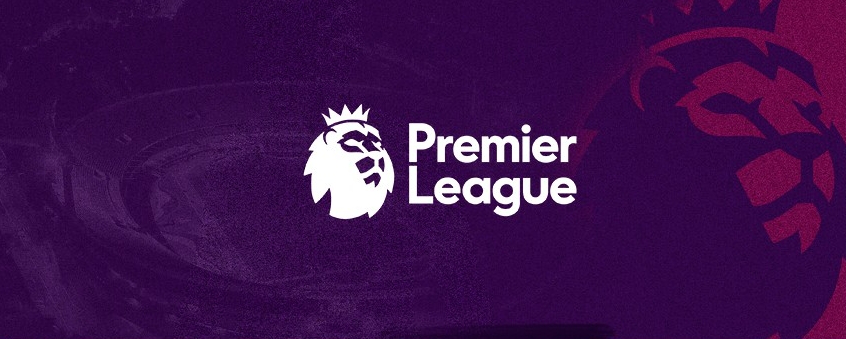
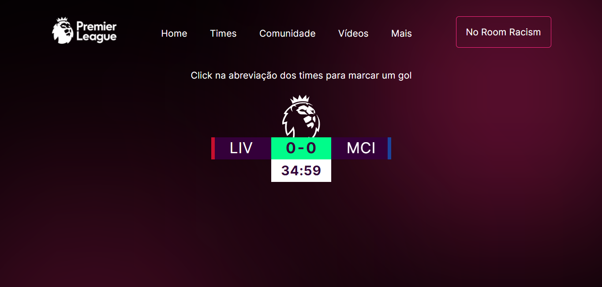

<div align="center">
   
</div>
<br/>
<div align="center">
   <a href="#-tecnologias-utilizadas">
      
      
   </a>
</div>

</br>


## 💻 About

📁 Premier League PWA - This is a WEB Application that allows users to send notifications.
The project was developed for the Mobile Applications course as a work during college.


## 🎨 Layout

Developed layout

<div align="center">
  
</div>


## 🛠 Technologies

The following tools were used in the construction of the project:

- [React][React]
- [TypeScript][TypeScript]

## 🚀 Getting Started

1. Front End

### 🎲 Running the Front End

```bash
# Clone this repository
$ git clone https://github.com/YagoVela/Premier-League-PWA

# Go to the project folder in terminal/cmd
$ cd premier-league-pwa

# Install the dependencies
$ yarn

# Run the application in development mode
$ yarn start

```


## 📝 License

Made by Yago Vela 👋🏽 [Entre em contato!](https://github.com/YagoVela)


[React]: https://reactjs.org/
[Typescript]: https://www.typescriptlang.org/

